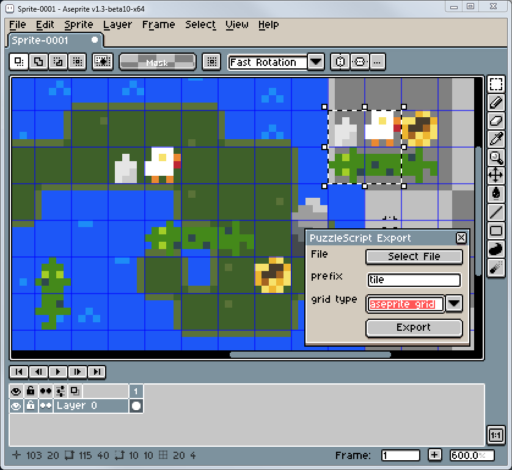

# Aseprite PuzzleScript Export

A script for [Aseprite](https://www.aseprite.org/) that exports images as [PuzzleScript](https://www.puzzlescript.net/) sprites.

## Example



This exports as:

```
tile1
#e5e5e5 #cccccc
.....
..0..
.000.
.001.
.011.

tile2
#ffffff #f7e26b #eb8931 #be2633
.000.
.0102
00003
0000.
.2.2.

tile3
#44891a #a3ce27 #2f484e
...0.
.0100
00000
.0102
...0.

tile4
#44891a #2f484e
.....
00000
01000
00010
.....
```

## Installation

Save [PuzzleScriptExport.lua](https://raw.githubusercontent.com/pancelor/aseprite-puzzlescript-export/main/PuzzleScriptExport.lua) to your Aseprite scripts folder (File > Scripts > Open Scripts Folder)

## Usage

* Open the exporter from the Aseprite menu: File > Scripts > PuzzleScriptExport
* Choose your export settings
* Press the "Export" button
* Open the export file and copy the exported text into your PuzzleScript game
* Leave the window open to export again later

If you select a rectangle in your image and then press the "Export" button, only that rectangle will be exported.

### Export Settings

* `File`: choose which file the sprites will be exported to.
  * This file will be **completely overwritten** every time you export.
* `prefix`: change the prefix of the autogenerated sprite names
* `use aseprite grid`:
  * if checked, the exporter will export tiles from the aseprite grid (View > Grid > Grid Settings)
  * if unchecked, the exporter will export 5x5 tiles

### Transparent Sprites

This script will consider any color with alpha value 0 as transparent. Make sure the layer you're exporting from is a "Layer", not a "Background".
