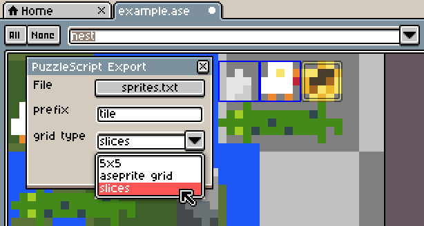

# Aseprite PuzzleScript Export

A script for [Aseprite](https://www.aseprite.org/) that exports images as [PuzzleScript](https://www.puzzlescript.net/) sprites.

## Video example

<a href="https://t.co/0x6qW3dZLq">pic.twitter.com/0x6qW3dZLq</a>

## Example


This exports as:

```
aseprite1
#e5e5e5 #cccccc
.....
..0..
.000.
.001.
.011.

aseprite2
#ffffff #f7e26b #eb8931 #be2633
.000.
.0102
00003
0000.
.2.2.

aseprite3
#44891a #a3ce27 #2f484e
...0.
.0100
00000
.0102
...0.

aseprite4
#44891a #2f484e
.....
00000
01000
00010
.....
```

## Installation

Save [PuzzleScriptExport.lua](https://raw.githubusercontent.com/pancelor/aseprite-puzzlescript-export/main/PuzzleScriptExport.lua) to your Aseprite scripts folder (File > Scripts > Open Scripts Folder)

## Usage

* Open the exporter from the Aseprite menu: File > Scripts > PuzzleScriptExport
* Choose your export settings (see below)
* Press the "Export" button
* Open the export file and copy the exported text into your PuzzleScript game
* Leave the export window open to quickly export again later

If you select a rectangle in your image and then press the "Export" button, only the tiles inside that rectangle will be exported.

### Export Settings

* `File`: choose which file the sprites will be exported to.
  * This file will be **completely overwritten** every time you export!
* `grid type`:
  * `5x5`: the exporter will export 5x5 tiles.
  * `aseprite grid`: the exporter will export tiles from the aseprite grid. (View > Grid > Grid Settings)
  * `slices`: the exporter will export the sprite's [slices](https://www.aseprite.org/docs/slices/) - this lets you name your sprites in Aseprite, instead of needing to rename them after exporting.
* `active layer only`: whether to export visible pixels (default) or just the pixels from the current layer.

(why would you want non-5x5 sprites? there are [PuzzleScript](https://auroriax.github.io/PuzzleScript/editor.html) [forks](https://github.com/broken-sign-games/PuzzleScript) out there that allow differently-sized sprites)

## Other notes

### Slices!

[Named slices](https://www.aseprite.org/docs/slices/) are supported.



### Transparent Sprites

This script will consider any color with alpha value 0 as transparent. Make sure the layer you're exporting from is a "Layer", not a "Background". (Right click on a background layer > Convert To > Layer)

### Feature Wishlist

Will these be implemented? We'll see! If you decide to implement these yourself, feel free to open a pull request!

- [x] add support for [slices](https://www.aseprite.org/docs/slices/)
- [x] add support for indexed/palettized images
- [x] add ability to export the current layer only
- [x] add support for [tilemap](https://www.aseprite.org/docs/tilemap) layers
- [ ] deduplicate exported tiles
- [ ] add support for [tilemaps](https://www.aseprite.org/docs/tilemap) for level creation (not just sprite drawing)
